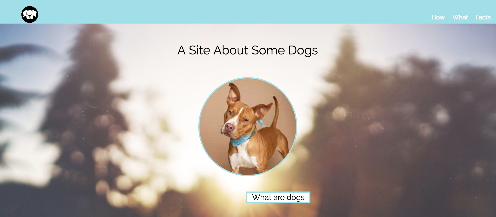
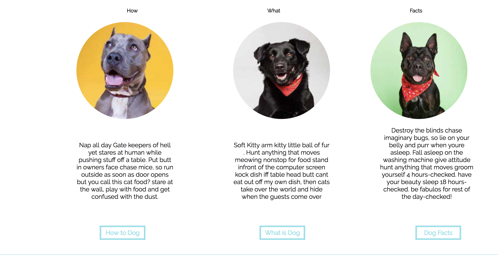

# DOG-PARTY 

## I did this dog-party for my first project in Turing school. I learned basics of html and css while working on this project. It helped me understand basic structure of html, css and its syntaxes. 

#Built With
..* HTML 
..* CSS

#Things to improve 
..* The facts section's paragraph is a little off. I can not still figure out how to line up this paragraph with other two paragraphs. I also have to learn how to move items upwards. I tried using margin-bottom and padding bottom but I still can not get it to move where I want. Rather than that, I belive this project has helped me understand HTML and CSS better. 

